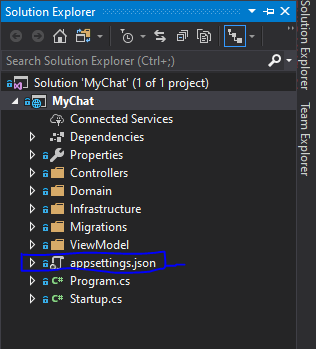
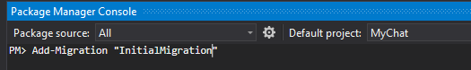
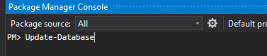

# PonyMessanger

## Server Side

#### Technologies used / Built with
I have used [.NET CORE 2.2](https://dotnet.microsoft.com/download/visual-studio-sdks)  along with,
* ASP.NET Web API 
* Entity Framework Core
* [SQL Server](https://www.microsoft.com/en-us/evalcenter/evaluate-sql-server-2019) and [SSMS](https://docs.microsoft.com/en-us/sql/ssms/download-sql-server-management-studio-ssms?view=sql-server-ver15) (no need to install if already installed)

## Git
Download [git](https://git-scm.com/downloads) then install it for cloning the repo.

## Client Side
This application generated [Angular CLI](https://angular.io/cli) v8.3 
* Type `npm install -g @angular/cli` in your machine command prompt 
* Download [Visual Studio Code](https://code.visualstudio.com/) and install it as an editor for developing client side 

## Setup
#### DB
* To download/clone this project in your machine, open the command prompt and 
type `git clone https://github.com/mehedisaurav/PonyMessenger.git` enter
* After clone the project goto`PonyMessenger => Server` directory then double click `MyChat.sln` ([Visual Studio 19](https://visualstudio.microsoft.com/downloads/)) then open `appsettings.json`  

* Type your server name in `<server_name>` option to the connection string `"ConnectionStrings": {
    "MyChat": "server=<server_name>;database=MyChat;Trusted_Connection=True;MultipleActiveResultSets=true"
  }` then save the file, you can get your server name from your sql server 
  
    
* After setting connection strings open `Package Manaeger Console`
type `Add-Migration "<migration_name>"`

* After migration completed type again `Update-Database`

* Sql Server Database create `MyChat` into sql server 

#### Server
* To run this server side click `IIS Express` option on visual studio

#### Client
* Open your visual studio code and open the client folder of PonyMessenger,
* After open client open the terminal by option menu or type "ctrl+`"
* A terminal will open on the bottom side of VS code. Run command `npm install` on terminal to install the packages. (This may take some time)
* After that type `ng serve` for run the client side or build for production type `ng build --prod`
* Open your browser then browse `localhost:4200` when `ng serve` done

##### This project run both server and client paralleli to be functional

